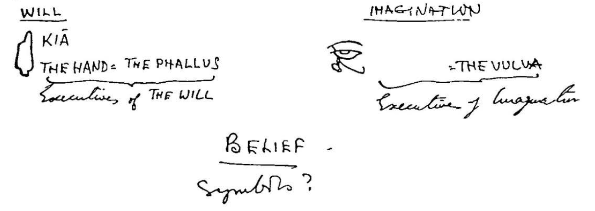

# 📚 Le Sorcier Inconnuの書架──翻訳と注釈の目録

このページは、作成済み、制作途中、制作予定のものに簡単にアクセスできるよう公開しています。 
メニュー構成、各ページの内容や予定は、断りなく変更される可能性があります。

---

## 🗂 注目の最新記事など

- 🆕  [アラン・ムーア：ケイオスマジックは「ファーストフード魔術」発言（該当ページ抜粋／英語）](Alanmoore_Chaos_Magic_2025.pdf)
- 🆕 [コードン・ホワイト：アラン・ムーアに反論（YouTube:英語/日本語設定可能）](https://www.youtube.com/watch?v=KyduQCcRbFs)
- 🆕 [ピータ・キャロル：アラン・ムーアに反論（Specularium:英語/Google翻訳可能）](https://www.specularium.org/blog/mayblog-2025)
  
---

## 🔗 翻訳＋注釈Zineプロジェクト

1. **🎨 オースティン・オスマン・スペア関連** 

- 🎨 [オースティン・オスマン・スペアの『快楽の書』の翻訳＋注釈Zine──ZOS/KIAと魔術の原点](https://github.com/ravensgate-tux/book_of_pleasure/blob/main/README.md)
- 🎨 [オースティン・オスマン・スペアの『ゾスの呪詛――偽善者たちへの説教』翻訳Zine](https://github.com/ravensgate-tux/Anathema_of_Zos/blob/main/README.md)
- 🎨 [オースティン・オスマン・スペアの『半獣神たちの書』翻訳Zine](https://github.com/ravensgate-tux/book_satyrs/blob/main/README.md)
- 🎨 [オースティン・オスマン・スペアの『地上の地獄』翻訳Zine）](https://github.com/ravensgate-tux/earth_inferno/blob/main/README.md)  
- 🚧 [オースティン・オスマン・スペアの『生活の焦点』翻訳Zine（**製作中🚧**）](https://github.com/ravensgate-tux/focus-of-life/blob/main/README.md_404)

#### スペアの全著作について alphabetという語の調査結果をまとめると…

- 1️⃣『半獣神たちの書』– 絵のみ（スペアの文なし）
- 2️⃣『快楽の書』– 魔術論：alphabet (4)、sacred alphabet (2)
- 3️⃣『地上の地獄』– 絵と詩：alphabet (0)
- 4️⃣『生活の集中』– 詩：alphabet (1)
- 5️⃣『ゾスの呪詛』– 自動書記による詩：Alphabetic (1)、Alphabet (1)
  
#### 🐌論理的な説明文があるのは2️⃣のみ 

- つまり、“聖なるアルファベット”も“欲望のアルファベット”も、スペアの文にはまったく登場しない 
- 『快楽の書』に2回出てくるsacred alphabetは形容詞＋普通名詞という一般的な表現） 
  
#### ❓ 『Zos Speaks!』（ケネス・グラント）に書かれた謎の「欲望のアルファベット」構築作業

- なお[『Zos Speaks!』](https://www.amazon.co.jp/dp/B0CQ9YDG9N)には、1954年9月14日頃からグラントの依頼でスペアが「欲望のアルファベット」を完成させていく過程が記録されている 
- グラントからは「Zos＝手」「Kia＝目」と書かれた手書きメモとシジルが送られ(1954年10月10日)、スペアは「自分の書いたものではないと思う」と述べるが、その後Zos-Kiaの概念は変質 
- 最終的にグラントはこれを「欲望のアルファベット」と呼ぶ（1954年11月5日）ようになる 
- ケネス・グラントからスペアに送られてきた手書きのメモ(1954年10月10月) 

 

 

- [参考文献『Zos Speaks!』(Amazon)](https://www.amazon.co.jp/dp/B0CQ9YDG9N)

 

2. **🕶 グラント・モリスン関連** 

- 🕶 [グラント・モリスン著『Pop Magic』への注釈Zine](https://github.com/ravensgate-tux/pop_magic_annotation/blob/main/README.md)
- 🕶 [グラント・モリスン『BATMAN R.I.P.』から読み解く「深淵」と「降下」Zine](https://github.com/ravensgate-tux/batman_rip_zine/blob/main/README.md)

3. **🦑 フィル・ハイン関連** 

- 🦑　[フィル・ハイン著『現代シャーマニズムの技法 第1巻』への注釈Zine](https://github.com/ravensgate-tux/hine_modern_shamanism/blob/main/README.md)
- 🦑　[『喚起魔術の技法──フィル・ハインによる魔術実践と存在論の試み』の翻訳＋注釈Zine](https://github.com/ravensgate-tux/hine_evocation/blob/main/README.md)

---

## 🧙 呪術プロトコル

- [🐘 ガネーシャ神殿での日拝](https://github.com/ravensgate-tux/ganesha_morning/blob/main/README.md)
- [🐘 ガネーシャへの感謝の儀式](https://github.com/ravensgate-tux/ganesha_gratitude/blob/main/README.md)
- [🐘 ガネーシャへの体重減少（ダイエット）の儀式](https://github.com/ravensgate-tux/ganesha_diet/blob/main/README.md)
- [🌓 ヘカテ女神への日拝](https://github.com/ravensgate-tux/hekate-daily-ritual/blob/main/README.md)
- [🌓 ヘカテ神殿と自宅を保護するための儀式](https://github.com/ravensgate-tux/hekate-protection-ritual/blob/main/README.md)
- [🌓 神殿でのタロット聖別儀式](https://github.com/ravensgate-tux/hekate-tarot-ritual/blob/main/README.md)
- [🌓 旅の安全を祈る儀式](https://github.com/ravensgate-tux/travel-protection-ritual/blob/main/README.md)
- [🌓 ネガティブな影響を追い払う儀式](https://github.com/ravensgate-tux/banishing-negative-ritual/blob/main/README.md)
- [🌓 本棚神殿での金運上昇の儀式](https://github.com/ravensgate-tux/golden-prosperity-ritual/blob/main/README.md)
- [🌓 四元素の夜のワーク](https://github.com/ravensgate-tux/work_elemental_camp_work/blob/master/README.md)
- [🌓 Hekateチャントガイドブック](https://github.com/ravensgate-tux/hekate-chants/blob/main/README.md)
- [🃏 キャンプ地での地霊への祈り（TAZ）](https://github.com/ravensgate-tux/prayer_to_campground/blob/main/README.md)
- [🃏 明日のプレゼンテーションに効く儀式](https://github.com/ravensgate-tux/presentation_spell/blob/main/README.md)
- [🔥 ベルテイン／5月の祭の祝祭プロトコル](https://github.com/ravensgate-tux/beltaine_ritual/blob/main/README.md)
- [🔥 カタツムリの祝祭（4月22日・アースデイ）](https://github.com/ravensgate-tux/snailmas/blob/main/README.md)
- [🔬 本棚神殿の作り方](https://github.com/ravensgate-tux/bookshelf-temple/blob/main/README.md)

---

## 🧙 内的ワーク

- [🐘 ガネーシャ・デーモン・モーフィング　（Fil Hine方式）](https://github.com/ravensgate-tux/hine_ganesha_morphing/blob/main/README.md)
- [🌓 ヘカテの三重なる道（Ravensgate流 再構成儀式）](https://github.com/ravensgate-tux/hekate_ascending_flame/blob/main/README.md)
- [🌓 ヘカテの内なる炎](https://github.com/ravensgate-tux/work_frame_threshold/blob/main/README.md)
- [🌓 カードを使った肉体と精神の浄化と調和](https://github.com/ravensgate-tux/work_mental_cleansing/blob/main/README.md)
- [🌓 過去の判断を解放するパスワーキング](https://github.com/ravensgate-tux/work_justice_passworking/blob/main/README.md)
- [🌓 ペンタクルの女王と癒しのパスワーキング](https://github.com/ravensgate-tux/work_healing_queen_of_pentacles/blob/main/README.md)
- [🌓 ヘカテとアゾート瞑想の月の儀式](https://github.com/ravensgate-tux/work_the_moon_hekate/blob/main/README.md)
- [🌓 過去を手放し次の段階へと移行する儀式](https://github.com/ravensgate-tux/work_key_transition/blob/main/README.md)
- [🌓「世界」カードを使った睡眠前の内的ワーク](https://github.com/ravensgate-tux/work_sleep_tarot/blob/main/README.md)
- [🌓 内面の自己と向き合う（内なる十字路）自己鍛錬](https://github.com/ravensgate-tux/work_inner_circle/blob/main/README.md)
- [🃏 自己鍛錬のための The Power of One](https://github.com/ravensgate-tux/work_power_of_one/blob/main/README.md)
- [🃏 Ganesha Kumano Ritual（個人的な儀式：英語）](https://github.com/ravensgate-tux/ganesha_kumano_ritual/blob/main/README.md)
- [🃏 8大祝祭とDeviant Moon Tarotの対応表](https://github.com/ravensgate-tux/document_wheel_of_the_year/blob/main/README.md)
- [🔬 漢字シジル・プロトコル v0.1（試作版）](https://github.com/ravensgate-tux/kanji-sigil/blob/main/README.md)
- 💻 [Witchcraft API v0.1](https://github.com/ravensgate-tux/witchcraft_api_v01/blob/main/README.md)

---

## 🧙‍♂️ 編集・注釈 by *Le Sorcier Inconnu*（知られざる呪術師）

> 忘れられたもの、無視されたもの、まだ名前のないものへ  
> 書かれざる言葉に、注釈という魔術を与える者

---

© 2025 知られざる呪術師（Le Sorcier Inconnu）  
本ドキュメントは [Creative Commons BY-SA 4.0](https://creativecommons.org/licenses/by-sa/4.0/deed.ja) に基づき公開されています。
