# 📚 Le Sorcier Inconnuの書架──翻訳と注釈の目録

このページは、作成済み、制作途中、制作予定のものに簡単にアクセスできるよう公開しています。 
メニュー構成、各ページの内容や予定は、断りなく変更される可能性があります。

---

## 🗂 注目の最新記事など

-  [アラン・ムーア：ケイオスマジックは「ファーストフード魔術」発言（該当ページ抜粋／英語）](Alanmoore_Chaos_Magic_2025.pdf)
-  [ゴードン・ホワイト：アラン・ムーアに反論（YouTube:英語/日本語設定可能）](https://www.youtube.com/watch?v=KyduQCcRbFs)
-  [ピータ・キャロル：アラン・ムーアに反論（Specularium:英語/Google翻訳可能）](https://www.specularium.org/blog/mayblog-2025)
-  [Deviant Moon Tarot 解説Zine](https://github.com/ravensgate-tux/deviant_moon/blob/main/README.md)
  
## 🧙‍♂️ 関係者紹介──現代魔術を語るキーパーソンたち

### 🧙 Alan Moore（アラン・ムーア　1953年11月18日 - ）  

 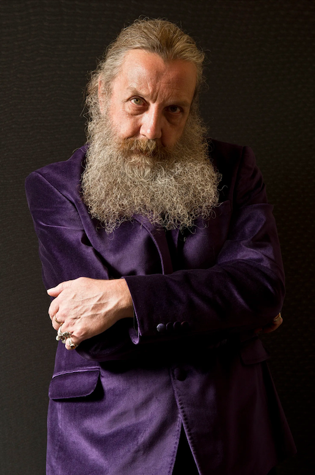

 

(画像出典:Wikipedia)

**職業：アメコミ原作者、儀式魔術師**  
**魔術的立場：儀式魔術とグリゴン信仰を重視／伝統的秘教の擁護者**

『ウォッチメン』『Vフォー・ヴェンデッタ』などで知られる英国の伝説的コミック作家。1993年に自らを「魔術師」と公言して以降、**実在しない神グリゴンを信仰するという独自の儀式を行い、象徴とパロディの統合的魔術を展開**。

🧾 **今回の騒動における主張：**  
2025年の著作で **「現代のケイオスマジックはファーストフード魔術である」** と批判し、より深い精神修養と伝統の重要性を訴えている。

**作品紹介『プロメテア(1)〜(3)』**

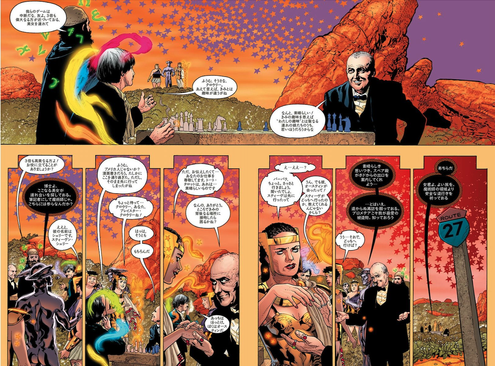
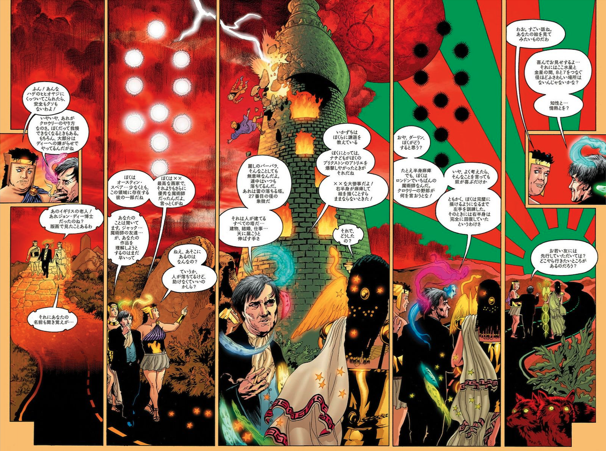

(画像出典:Amazon.co.jp)

---

### 🧙‍♂️ Grant Morrison（グラント・モリスン　1960年1月31日 - ）  

 

 

(画像出典:Wikipedia)
 
**職業：コミック作家、魔術実践者**  
**魔術的立場：シジル魔術と神格連携／ポップカルチャーとの接合**

『The Invisibles』の作者として**バンジージャンプ中にシジルをチャージする魔術体験**を告白し、以降のキャリアと魔術観の核心を築く。著書『POP MAGIC!』では **ガネーシャ神を魔術実践の“導きの神”** として重視し、西洋儀式魔術におけるヘルメスに対応する存在とした。

🧾 **今回の騒動における立場：**  
アラン・ムーアとの長年の対立関係の延長線上にありながら、**儀式魔術とシジル魔術、神格信仰とポップカルチャーを接続させる魔術**の有効性を改めて示している。

---

### 🧙‍♂️ Peter J. Carroll（ピーター・キャロル 1953年 - ）  

 
   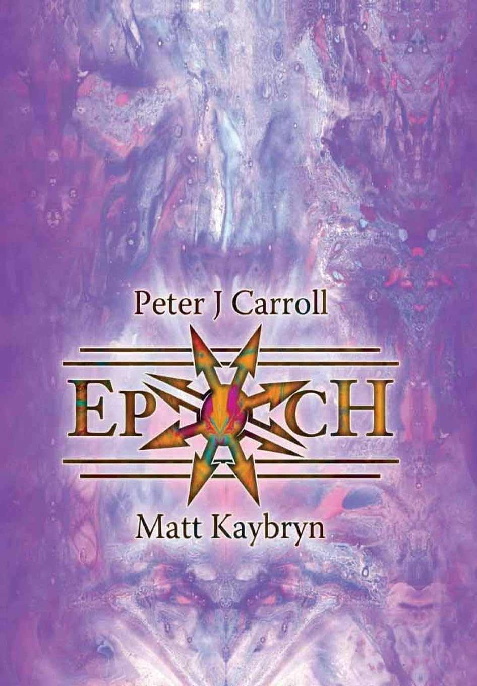

 

(画像出典：Amino「Ocultismo」コミュニティ)

**職業：物理学者、魔術理論家**  
**魔術的立場：可塑的信念と実用魔術の構築者**

『Liber Null』『Psychonaut』の著者であり、**ケイオスマジックの理論的創始者**。キャロルは、信念をツールとして扱い、必要に応じて信仰や儀式を柔軟に切り替える思想を展開した。これは後に「可塑的信念モデル」と呼ばれるようになり、ケイオスマジックの実践的・結果重視の傾向と強く結びついている。

🧾 **今回の騒動における動向：**  
2025年、アラン・ムーアが『Bumper Book of Magic』で **「ケイオスマジックは軽薄で疑似科学的」** と批判したことを受け、キャロルは自身のブログで反論。**クトゥルー神話の神格**を含む多様な象徴体系の使用も肯定している。

---

### 🧙‍♂️ Ivy Corvus（アイヴィ・コーヴァス）

  
  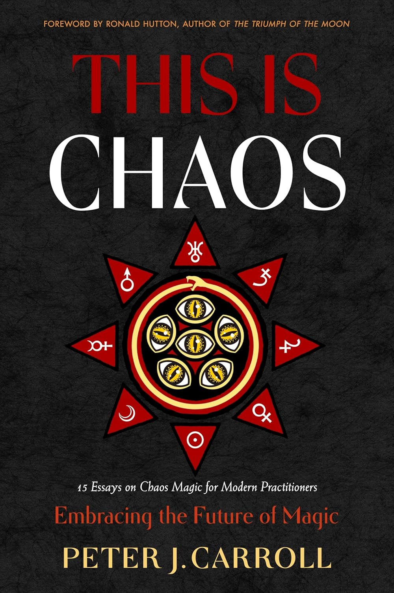

 

(画像出典：Amino「Ocultismo」コミュニティ)

**職業：魔術実践者、執筆者** 
**魔術的立場：タルパおよびサーヴィターの創造実践／人格構築魔術／意識存在との協働** 

「Tulpamancer（タルパマンサー）」として、意識存在を創造・維持・関係構築する技法を中心に探究。
タルパやサーヴィターを通じて、記憶・感情・創造性に働きかける魔術的アプローチを展開している。
2025年にはピーター・キャロル編の論集『**This is Chaos**』に寄稿し、人格化存在と魔術実践の関係を論じた。

YouTube等での発信も積極的に行い、象徴体系ではなく「共に生きる存在との協働」による魔術の再定義を試みている。

👉[@IvyTheOccultistのYouTubeチャンネル](https://www.youtube.com/@IvyTheOccultist)

---

### 🧙 Ray Sherwin（レイ・シャーウィン）

  
  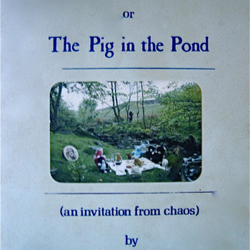

(画像出典:Bandcamp)

 

**職業：魔術実践者、出版者、アーティスト**
**魔術的立場：初期ケイオスマジックの共同創始者、Zos-Kia理論の再評価者**

『The Book of Results』『The Theatre of Magic』などの著者として知られる。Austin Osman Spareの影響を受け、Sigil Magicを現代的に再定義した。Peter J. CarrollとともにIOT（The Illuminates of Thanateros）の創設に関与し、のちに離脱。
- 彼の著書『The Book of Results』では、スパーの理論を基にした実践的な魔術手法が紹介されている。 
  [『The Book of Results』全文（PDF）](https://cdn.preterhuman.net/texts/religion.occult.new_age/occult_library/Sherwin_R-The_Book_Of_Results.pdf?utm_source=chatgpt.com)
- 彼の著書『The Theatre of Magick』では、スパーの手法を洗練させたシジル・マジックの方法論が解説されている。 
  [『The Theatre of Magick』](https://www.abebooks.com/9781481215145/Theatre-Magick-Sherwin-Ray-1481215140/plp?utm_source=chatgpt.com)

近年はアートと音楽を中心に活動しており、音声作品『The Pig in the Pond』を含む複数の楽曲を [Bandcamp](https://raysherwin.bandcamp.com/track/the-singing-tadpole) にて公開している。
▶♬ 注目コンテンツ：
Ray Sherwinによる音声詩作品『The Singing Tadpole』は、上記**Badndcamp**のリンク先で**無料で試聴可能**。シュールで儀式的な世界観を体感できる貴重な作品。

---

### 🧙‍♂️ Gordon White（ゴードン・ホワイト）  

  
  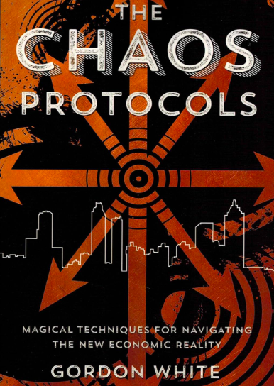

 

| 参加 | プログラム名 |
|:-----------|:--------------|
| ✅ Ravensgate | Gordon White’s Rune Soup |

(画像出典:Amazon)

**職業：占星術師、民俗学研究家、実践魔術家**  
**魔術的立場：アニミズムとケイオスマジックの融合／非西洋的霊性との調和**

📡**世界最大**のオンライン魔術トレーニングコミュニティー[『Rune Soup』ポッドキャスト](http://podcast.runesoup.com/)のホスト（6,000人以上のメンバ＝3,500時間/月の学習が行われている）として知られ、**近年のケイオスマジックにアニミズム的視点を持ち込んだ革新派**。オーストラリア先住民文化、グリモワール、民間信仰と西洋魔術の接合を追求する。**ディスカバリーチャンネルやBBCワールドワイド**といった世界的なメディア企業で長年働いて経験から作られたコースワークは映像的にも質が高い。

🧾 **今回の騒動におけるスタンス：**  
直接的なコメントは避けているが、YouTubeで**クトゥルー神話のような「フィクションを神格化する魔術はもう旧約聖書の時代」** と呼び距離を置く姿勢を取っている。人間と霊的存在の関係を見直し、実在的で生きた霊性を重視する立場から、現代の魔術界に一定の批判的再編を促している。

---

### 🧙‍♂️ Julian Vayne（ジュリアン・ヴェイン）

 

 

| 参加 | プログラム名 |
|:-----------|:--------------|
| ✅ Ravensgate | Julian Vayne’s Course |

(画像出典:Fulgur Press)

**職業： 実践魔術教師、サイケデリック研究者**
**著述家魔術的立場： 体験重視／意識拡張と健康の統合／伝統と現代の橋渡し**

**ケイオスマジックの実践家**でありながら、テンプル・オブ・セスや**ネオペイガン**の伝統にも造詣が深い。占星術やタロット、呪術、アヤワスカ体験、神秘体験を融合させる実践が特徴。

代表作　『Chaos Craft』『Now That’s What I Call Chaos Magic』『Getting Higher』のほか、「Imagination and Wellbeing」など教育的なコースも多数展開。

**今回の騒動におけるスタンス**
明確な発言はないが、柔軟性と健康志向、関係性を重視するスタンスは、ゴードン・ホワイトと近く、結果偏重の古いケイオスマジックへの批判とも共鳴している。

---

### 🧙‍♂️ Jason Miller（ジェイソン・ミラー）

 

 

(画像出典:Amazon)

| 参加 | プログラム名 |
|:--:|:--:|
| ✅ Ravensgate | Strategic Sorcery（TSS） |

**職業**：実践魔術家、スピリチュアル戦略コンサルタント、講師  
**魔術的立場**：西洋儀式魔術・チベット密教・ヴードゥー・NLPを融合した戦略的魔術／神秘と現実の両立を志向

📘『**Financial Sorcery**』『**Protection & Reversal Magick**』の著者として知られ、現代における魔術の実用性と持続可能性を追求している。  
西洋魔術に加え、**チベット密教**・**ニューオーリンズ/ハイチ・ヴードゥー**・**神経言語プログラミング（NLP）**・**ヘカテ女神の神殿奉仕**など、多分野にわたる実践経験を背景に、戦略的かつ持続可能な魔術を標榜するプログラム *Strategic Sorcery（TSS）* を主宰している。

#### 🧭 今回の騒動におけるスタンス：

公式なコメントは出しておらず、スタンスは不明。ただし、これまでの著作・講義・ブログ等において、**クトゥルフ神話のような「実在しないフィクション神格」への召喚や信仰行為は一切行っていない。**  
一貫して、現実に根ざした神格（特にヘカテ）との関係性と実践的魔術に重きを置いており、成果と応用性を優先する魔術思想が際立っている。

---

### 🐌 知られざる呪術師によるコラム  

###  EPOCH

### パンデモン期について

ピート・キャロルが最新刊『EPOCH』で語った「これからのケイオスマジックの時代」──それがパンデモン期（PANDAEMON AEON）である。

この時代には、ゴードン・ホワイトの「アニミズム」、ジュリアン・ヴェインの「ネオペイガニズム」、そしてフィル・ハインの「シャーマニズム」といった多様な流派が、奇しくも共鳴する傾向を示している。

### パンデモン期における主要な特徴

- **精霊との共鳴**
- **土地との対話**
- **死者との連続性**

こうした**アニミズム的世界観**が、再び重要性を帯びるとされている。

### ピート・キャロルのサイコヒストリー図との一致

キャロルが『Liber Kaos』や『EPOCH』に示した三つのパラダイムの交差──

- 🟢 Transcendental Paradigm（超越的）
- 🔵 Magickal Paradigm（魔術的）
- 🔴 Materialistic Paradigm（物質主義的）

 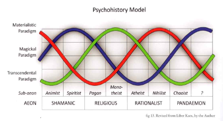

 

（画像参照：『EPOCH』ピート・キャロル）

このうち、**パンデモン期では再び「超越的パラダイム」が上昇しはじめている**と読み解くことができる。

### 意図ではなく「関係性（Relationality）」へ

かつてケイオスマジックは「結果」や「意図の力」に重点を置きすぎていた、と**アラン・ムーア**は2025年に著書で批判した。

一方、**ゴードン・ホワイト**は「これからの魔術は関係性と対話性を重視する」とし、**ジュリアン・ヴェイン**もまた「体験・共鳴・儀礼を通した霊的現実」を実行している。

これらの潮流は、キャロルが予言したパンデモン期の本質──**神格との共存、信仰ではなく関与による魔術**──と明確に響きあっていると思われる。

このことは、ここに名を挙げたメンバーの全員が納得しいているように見える。
そうなのであれば、アラン・ムーアが批判する **「クトゥルフ神話の神格」** を召喚することはもはや不要なのではないだろうか。

   

 

### 『EPOCH』P43～P48 要約  
### Theometry and Aeonics（神性幾何学と永劫論）

ピート・キャロルは本章において、人類の神観・宗教観の歴史を5つの「アイオン（思想時代）」として整理している。

1. **シャーマニック期** – 自然界の精霊や祖霊と交信する時代  
2. **ペイガン期** – 神話と儀式体系の発達。多神教的世界  
3. **モノセイスト期** – 唯一神の時代。ヤハウェやアッラーなど  
4. **アセイスト期** – 神の死と、イデオロギーや著名人の神格化  
5. **パンデモン期** – すべての神々が再び開放され、個人が神格創造者となる現代

### パンデモン期における神格とタロット

この新しい時代、神々は信仰対象ではなく「個人の意図（Intent）」を投影する“乗り物”として扱われる。  
→ タロットはこの「意図の器（vehicles of intent）」として再解釈される。

キャロルは以下の8つの基本意図（Archetypal Intents）を中心に分類している

| Intent      | Planet  | Color     | 概要                       |
|-------------|---------|-----------|----------------------------|
| Magic       | Uranus  | Octarine  | 異端と神秘                |
| Death       | Saturn  | Black     | 終焉と沈思黙考             |
| Power       | Jupiter | Blue      | 富・拡張                  |
| War         | Mars    | Red       | 競争と闘争                |
| Charisma    | Sol     | Gold      | 自我と輝き                |
| Love        | Venus   | Green     | 感情と共感                |
| Intellect   | Mercury | Orange    | 情報・操作・論理          |
| Sex         | Luna    | Purple    | 欲望・魅惑                |

これらの「意図」は2つずつ組み合わせて **28の複合神格（Bi-planetary Intents）** を構成し、新しい神話的構造を編み出すことができる。

## 現代魔術への応用

- 神格やタロットは「使うもの」であり、「仕えるもの」ではない  
- デッキはRWSやトートだけでなく、自己流の神話的枠組みに基づいて再設計可能  
- 神格の創造・混合・象徴再編成によって、「意図」としての神がより有機的に働く

このように、『EPOCH』はパンデモン期の魔術師にとって「神々と象徴の再創造」というテーマを投げかけている。

※本要約は該当章（p.43〜p.48）の内容に基づいて再構成したものであり、引用ではなく解釈的要約です。

---

## 🔗 翻訳＋注釈Zineプロジェクト

### AOS01

#### 1. **🎨 オースティン・オスマン・スペア関連** 

 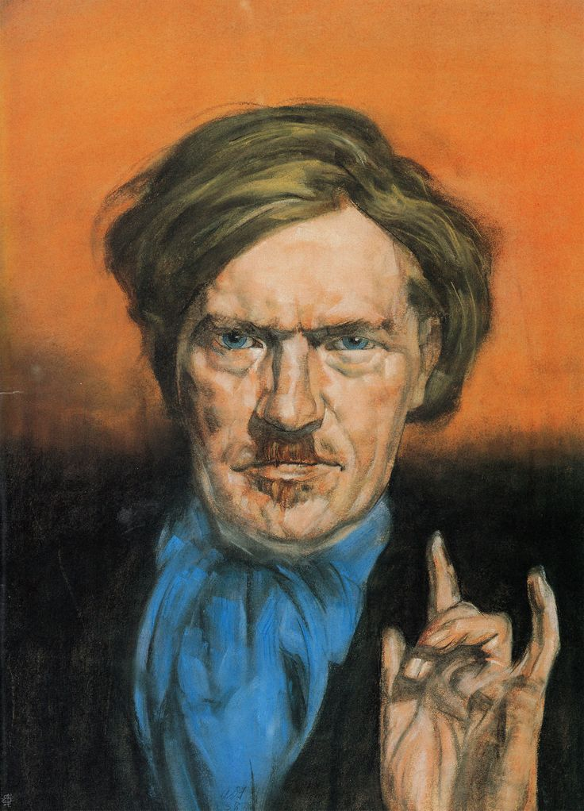

 

- 🎨 [『地上の地獄(1905年)』翻訳Zine](https://github.com/ravensgate-tux/earth_inferno/blob/main/README.md)
- 🎨 [『半獣神たちの書 (1907年)』翻訳Zine](https://github.com/ravensgate-tux/book_satyrs/blob/main/README.md)
- 🎨 [『快楽の書 (1913年)』の翻訳＋注釈Zine──ZOS/KIAと魔術の原点](https://github.com/ravensgate-tux/book_of_pleasure/blob/main/README.md)
- 🎨 [『生命の焦点(1921年)』翻訳Zine](https://github.com/ravensgate-tux/focus-of-life/blob/main/README.md)
- 🎨 [『ゾスの呪詛 (1927年)――偽善者たちへの説教』翻訳Zine](https://github.com/ravensgate-tux/Anathema_of_Zos/blob/main/README.md)

#### スペアの全著作について alphabetという語の出現頻度を調べた…(「聖なるアルファベット」って固有名詞じゃないんじゃね？仮説）

- 1️⃣『地上の地獄』– 絵と詩：alphabet (0)
- 2️⃣『半獣神たちの書』– 絵のみ（スペアの文なし）
- 3️⃣『快楽の書』– 魔術論：alphabet (4)、sacred alphabet (2)
- 4️⃣『生活の集中』– 詩：alphabet (1)
- 5️⃣『ゾスの呪詛』– 自動書記による詩：Alphabetic (1)、Alphabet (1)
  
#### 🐌論理的な説明文があるのは2️⃣のみで、あとは絵だけか詩作品 

- つまり、**“聖なるアルファベット”も“欲望のアルファベット”も、スペアの文にはまったく登場しない** 
- 『快楽の書』に2回出てくるsacred alphabetは形容詞＋普通名詞という一般的な表現 
  
#### ❓ 『Zos Speaks!』（ケネス・グラント）に書かれた謎の「欲望のアルファベット」構築作業(スペア68歳頃)

- なお『Zos Speaks!』というスペアとケネス・グラントの往復書簡を収めた書籍がある。著者はケネス・グラント 
- この文書には1954年9月14日頃からグラントの依頼でスペアが「欲望のアルファベット」を完成させていく過程が記録されている 
- 68歳で記憶も判断力も落ちていると言うスペアにグラントから逆にこういうシジルだったとスペアに対して送り付けられていく 
- 1954年9月14日にスペアが書いた（と、ケネス・グラントが自書に書いているのがこちら）
  
>Can't help you now re o Sacred Alpha: Key to it & over 300 letters & words (sufficient magicial words to convey anything) was all destroyed in the Blitz ... What with loss of memory & lousy normal memory I've still to make the effort to re-member & reform it again . You shall know when I do - just two or three days in the Country & it will gush out!

- グラントからは「Zos＝手」「Kia＝目」と書かれた手書きメモとシジルが送られ(1954年10月10日)、スペアは「自分の書いたものではないと思う」と述べるが、その後Zos-Kiaの概念は変質する 
- 最終的にグラントはこれを「欲望のアルファベット」と呼ぶ（1954年11月5日） 
- グラントは **ZOS KIA CULTUS** (ZOS KIA 崇拝とか教義とか’カルト’などの意味) という言葉を使い始める（1954年12月11日） 
- [参考文献『Zos Speaks!』(Amazon)](https://www.amazon.co.jp/dp/B0CQ9YDG9N)　なぜか「年齢確認」を求められるが、そのまま進んでOK。中身はこの本 
- 参考: ケネス・グラントからスペアに送られてきた手書きのメモ（1954年10月10月） 

 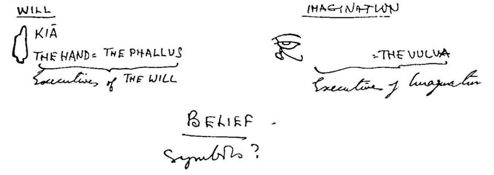

 

 

 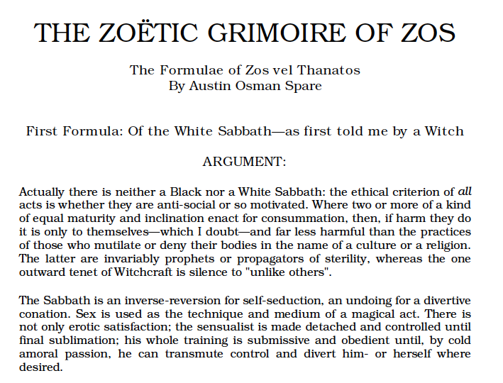
 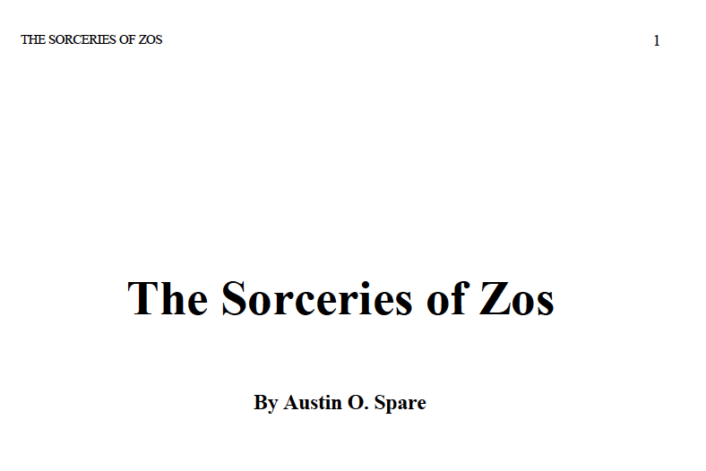

 

>知られざる呪術師は、上記の「ゾスの魔導書」とよばれるスペアが書いたといわれる文書を2種類所有しているが、スペアにしては、あまりに整った英文の文体でAIの分析でもこれは別人が書いたものと判断されている。そのうちの一つは著者名はオースティン・オスマン・スペアと記述があるものの、書いたのはケネス・グラントと書かれている。

### AOS02

#### 🐌 Austin Osman Spareの思想とKenneth Grantとの乖離について

**Spare思想のコア（ぶれない三本柱）**

1. **二元論の拒否（Neither-Neither Principle）**  
　善悪、霊肉、主体客体といったあらゆる二元的構造を拒否。  
　「どちらでもなく、どちらでもある（neither-neither）」という立場に身を置く。

2. **道徳の否定（Anti-ethics）**  
　道徳とは「借り物の欲望」にすぎず、社会的正しさではなく自己の真実（Will）を重視すべき。

3. **自己愛・自己神格化（Self-love / Self-deification）**  
　ナルシシズムではなく、「欲望そのもの」としての自己を愛する行為。  
　KiaやZosの概念は、**個体を通して宇宙意識に接続する道**として位置づけられる。

**Kenneth Grantとの乖離**

- GrantはSpareを「宇宙魔術の始祖」「ダアトの先導者」として神話化
- 外宇宙的存在やトンネル・オブ・セット（Tunnels of Set）と結びつけ、体系的・宇宙論的な魔術システムへと再構築
- Zos=手=男性原理、Kia=目=女性原理とし、特にスペアの最重要定義であったKiaの定義を極端に矮小化
- SpareのKIAは「欲望の純粋意志」「あらゆる形を超えた創造的無意識」であり、  
  **性別にすら還元されない、全的かつ非人格的な原理**である。
> GrantのようにKIAを「女性原理」に固定することは、  
> Spareにとって最大の敵であった**二元論への回帰そのもの**である。
- つまり、GrantによるZOS-KIAの男女分割は、Spareが拒否し続けた世界観の枠組みに彼を押し込めるものであり、  
  **KIAの途方もない矮小化**といえる。

### AOS03

#### 🃏 Austin Osman Spare の 1906 年タロットデッキ（『Lost Envoy』）概要

 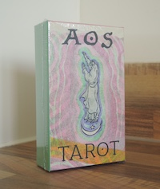

 

（画像参照：handsomebooks.uk）

#### 🔹 制作背景
Austin Osman Spare は 1904〜1909 年の間に、**78 枚の手描き・手彩色のタロットデッキ**を制作。彼の初期のオカルト関心と芸術的実験を反映したユニークな作品である。

#### 🔹 デッキの構成と特徴

- **構成**：全78枚。マルセイユ版や Oswald Wirth のデッキの影響を受けつつも、完全に独自の象徴性
- **スート**：伝統的な「カップ・剣・コイン・杖」ではなく、**ハート・スペード・ダイヤ・クラブ**のトランプ様式
- **コートカード**：最小限の表現で、**人物の頭部のみ**が描かれている
- **注釈付き**：上下に Spare 自筆の意味説明（正位置・逆位置）が記載されている
- **連続絵画的構成**：一部のカードは、隣接カードと連結すると**蛇などの図像**が現れる設計
- **裏面**：統一されておらず、**黒・ピンク・緑・紫など色彩豊かに手塗り**されている

#### 🔹 再発見と出版

- **1944年**：The Magic Circle Museum に寄贈されるも、長らく未公開
- **2013年**：Jonathan Allen により再発見
- **2016年**：Strange Attractor Press より『**Lost Envoy**』として書籍化
- **2023年**：Kickstarter にてデッキ復刻と新版出版が実現

 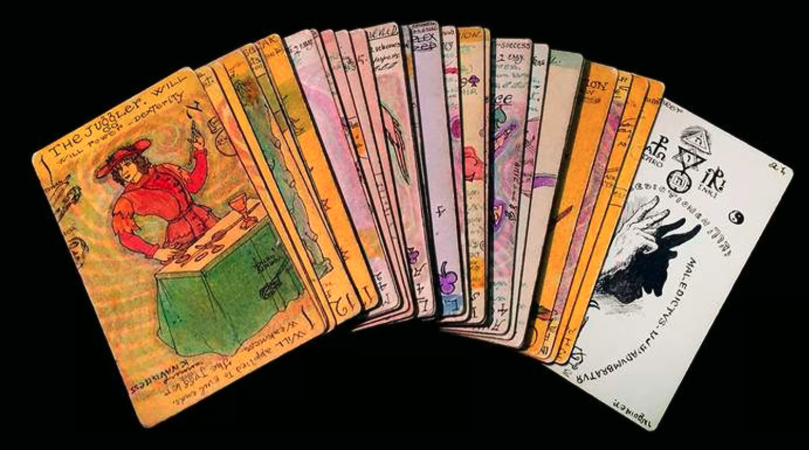

 

（画像参照：kickstarter.com）

**KICKSTARTER** 👉 [Austin Osman Spare Tarot Deck & Book](https://www.kickstarter.com/projects/strangeattractoruk/austin-osman-spare-occult-tarot-deck-and-book)

#### 🧠 コメント
このデッキは、**歴史的価値と芸術的実験の交差点**に立つ作品。Spare の内的ヴィジョンと初期魔術体系（Zos-Kia）への鍵ともなり得る貴重なタロット資料。

> 🔗 [レビュー元（handsomebooks.uk）](https://handsomebooks.uk/review-austin-osman-spare-1906-tarot-deck.html)

 

### AOS04

 
 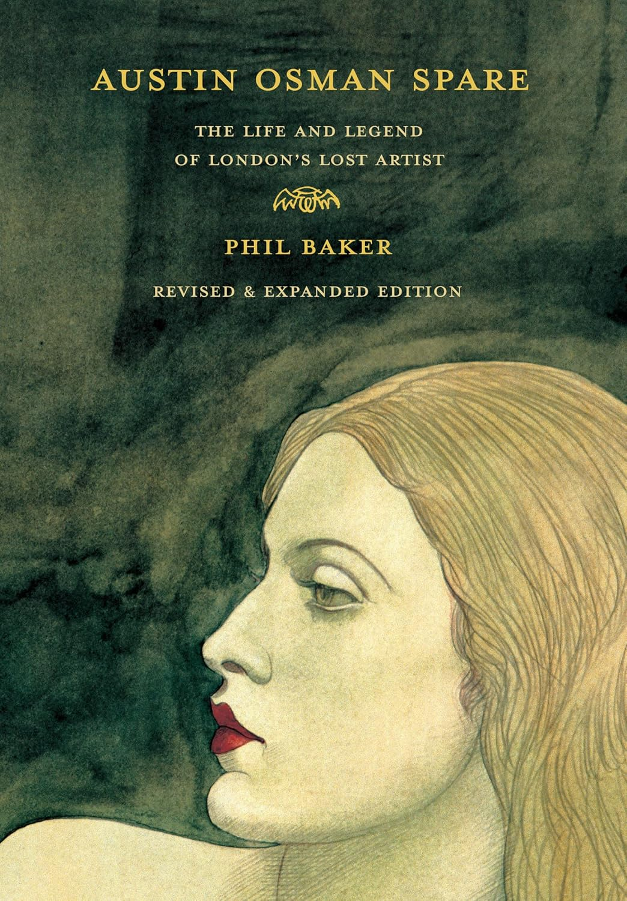

 

オースティン・オズマン・スペア、改訂版：ロンドンの失われた芸術家の生涯と伝説（英語版）フィル・ベイカー 
[Amazon.co.jp](https://www.amazon.co.jp/gp/product/B09RPMS24P/ref=kinw_myk_ro_title)

#### Phil BakerによるSpare伝記とAlan Mooreの序文 

**1. Phil Bakerの試みと意義**

- Phil Bakerは、これまで本人以外により語られてきた  
  Austin Osman Spareの人物像を統一感と説得力をもって再構成した  
- Spareに関する従来の誇張された神秘的・逸話的イメージ  
  （例：ZosやKia、死の姿勢など）を地に足のついた実在の人間として再評価した  
- Kenneth Grantによる「二元論的解釈」や神話化に対しては距離を取り  
  Spare本人の言葉と生活から、より実態に即した像を提示している   

**2. Alan Mooreの評価と比較**

- MooreはSpareを、William Blakeと並ぶ「個人神話を創造した芸術家」として高く評価  
  その一方で、Spareの実像がKenneth Grantの解釈によって見えにくくなっていたことを指摘  
- Phil Bakerの著作はその神秘のベールを取り払い  
　Spareの実際の人生・性格・創作を冷静かつ親しみある筆致で描いた点を高く評価している  

**3. 両者に共通する観点**

- Spareの特異性（孤独、貧困、官能、個人神学）を神話ではなく、事実に即して記述  
- Grantによる誇張されたSpare像を反転させ、過度な「魔術的伝説」から彼を解放  
- 結果として、Spareの創造性・芸術性・人間性がより明確に浮かび上がってくる  

## A05
### AOS05

#### メモ：ケネス・グラントの言うNew Isis Lodgeの実在性について

**出典**
Phil Baker『Austin Osman Spare: The Life and Legend of London’s Lost Artist』（第二版ノート2）より

**内容の要約**
> "No trace has been found of the New Isis Lodge or its activities. No one I spoke to who had known Grant in the 1950s or 60s recalled it being mentioned. There are no extant documents, no photographs, no rituals, no initiates who can be found."

（訳）  
「ニュー・イシス・ロッジまたはその活動の痕跡は見つかっていない。1950年代から60年代にかけてグラントと関わりがあった人々に聞いても、ロッジの存在について語ったという話はなかった。現存する文書も写真も儀式もなく、イニシエートも確認されていない。」

**解釈** 
Kenneth Grantが主張していた "New Isis Lodge" の実在性には疑問が持たれており、客観的な裏付けは確認されていない。したがって、彼の著作に登場するこのロッジは、フィクションまたは象徴的構成物である可能性がある。

>つまり、グラントが後年に語ったニューイシス・ロッジの活動や構成は、少なくとも裏付けのある客観的証拠が発見されていないため、「実在しなかった可能性が高い」と考えられる。
>断定はできないものの、この見解は、グラントの著作群全体に対する懐疑的な視点と一致している。つまり、彼が描き出す「スペアの教義」や「Zos-Kia Cultus」も、フィクショナル（作為的）な構築物である可能性を孕んでいる。

**注意点**
存在しなかった証明が難しいため、この見解を用いる場合には、「確認されていない」「証拠が乏しい」といった表現を用いて、断定を避けつつ批判的視点を提示するのが望ましいだろう。

## AOS06

 

 

（画像参照：Amazon.co.jp）

>📘 本書について
>本書は、Austin Osman Spare の人物像と思想、とりわけ Zos＝Kia 理論について、
>Kenneth Grant らによって誇張・誤解されてきた可能性のある通説を、原資料と関係者証言をもとに徹底的に検証した決定的評伝である。
>著者は Phil Baker。序文を Alan Moore が寄せ、Spare を「ウィリアム・ブレイクと並ぶべき芸術家」として称えている。

#### Austin Osman Spare における「Zos」と「Kia」の思想

> 本稿は、Phil Baker 著  
> *Austin Osman Spare (Revised & Expanded Edition): The Life and Legend of London's Lost Artist*（Strange Attractor Press, 2022）  
> に基づき、研究・批評の目的で該当部分を翻訳・要約したものです。

**概要**

すでにスペアは、自身が「Zos（ゾス）」と「Kia（キア）」と呼ぶ中心的な思想、そしてその両者の相互作用について構想を深めていた。それは公立図書館の展示にも見られる言葉である。
スペアの思想は奇妙に感じられるかもしれないが、それはウィリアム・ブレイクの寓意体系（Urizen、Los、Four Zoas）と比べて特段異質というわけではない。

**Zos（ゾス）について**

- **定義**: 「Zos」は人間の身体全体を指し、通常の心（mind）も含まれる。死すべき肉体的存在としての人間の全体像。
- **自己同一性**: スペアは後年、自らを「Zos」と呼んでいた。
- **語源的背景**:
  - ギリシア語 *zoe*（生命）、*zoion*（動物）に由来。
  - 関連語: `zoo`, `zoological`, `Zoist`, `zoetic`（生命に関する）など。
- **神秘的な響き**:
  - 英語における `Z` の珍しさから、オカルティックな響きを持つ。
  - 例: Zeus, Zanoni（ビュルワー＝リットン）, Zoretti（W.B. Yeatsの霊導者）, Zohar, Zoroaster, Zosimos, Azazel, Azraelなど。
  - これらは "Zeddy mystic entities" または "dental sibilant gods（歯擦音の神々）" とも称される。

**Kia（キア）について**

- **定義の曖昧性**: 普遍的精神や神に似ているが人格的ではなく、より東洋的な非人格原理に近い。
- **比較される思想体系**:
  - ヒンドゥー教の **ブラフマン（Brahman）**
  - 道教の **道（Tao）**
  - 仏教の **空（Sunyata）**

**Kia の象徴と意味**

- 禿鷲、頭蓋骨、進化と関連。
- 宇宙の背後にある「肥沃なる虚無」。
- 完全に超然とし、自足する「魂の状態」。

**Taoとの共鳴**

> 「言葉で語れる道は、もはや道ではない」

- この観点から、彫刻されていない石はすでに可能性をすべて含んでおり、彫刻された石像よりも崇高である。
- Kia も同様に、**形を持たない完全性**として理想化される。

> Louis MacNeice：「『無』というものは、神秘的な意味において、宗教の基礎に不可欠な要素であるように思われる」

**語源と出典**

- **類似語彙**: ki, chi, khyā, chiah など、東洋・カバラ的語彙との音的共鳴。
- **最有力出典**:
  - ブラヴァツキー『シークレット・ドクトリン』の複合語 **Kia-yu**
  - スペアは A にアクセント（´）を付ける傾向あり。

**AOSの秘儀と Kia-Ra の意識**

- スペアは写本形式の魔術書『The Arcana of AOS and the Consciousness of Kia-Ra』を執筆。
- 数年前に Sotheby’s に出品された。

**ジャーナリストによる目撃証言（*The Daily Chronicle*）**

> この奇妙な宗教は、その若者（＝スペア）の人格にとって重要な要素である。彼はそれを文章で書き、ギラギラとした恐ろしい図版で彩っている。すべては二枚の木製の表紙に収められる予定で、それぞれに象徴が刻まれている。
>
> - 一方は「力（Power）」：両腕を広げた人間の腕を持つ象の頭部。
> - もう一方は、エジプトのイシス神を想起させる「冠せられた神格」。

**出典・参考文献**

- Phil Baker, *Austin Osman Spare (Revised & Expanded Edition): The Life and Legend of London's Lost Artist*, Strange Attractor Press, 2022.

**著作権と使用について**

この翻訳は、学術的・批評的目的に基づく「引用・紹介」に該当し、著作権法第32条に基づく正当な範囲で行われています。元資料の著者および出版社に最大限の敬意を表しつつ、日本語話者にスペア思想の理解を促進することを目的としています。

### AOS07

**🪷 Spareの「死のポーズ」と宗教観（Phil Bakerによる検証）**

Austin Osman Spare に関しては、Kenneth Grant や日本の一部オカルティストによって誤解・神話化されたイメージが流布している。  
だが、Phil Baker の詳細な伝記的研究（*Austin Osman Spare: The Life and Legend of London’s Lost Artist*）によって、  
Spare 本人の意図と思想は以下のように明確に再構成される。

**🧘 死のポーズ（Death Posture）**

- Spare はこの技法を「**シャヴァーサナ（Shavasana, 屍のポーズ）から名付けた**」と述べている。
- 実践内容は、筋肉緊張・呼吸法・意識集中・恍惚状態・忘却によるシジル投入で構成されており、  
  **自慰や単純な性魔術とは異なる、宗教的恍惚への技法**である。
- 「Zos（身体・存在）」を通じて「Kia（絶対意識・空）」に至るための**自己解体の儀式的姿勢**である。

**🙏 Kia = Void（空）という宗教観**

- KiaはSpareにとって「人格神」ではなく、「語りえぬ絶対的背景」。  
  Phil Bakerはこれを、**ヒンドゥーのブラフマン、道教のタオ、仏教の空（śūnyatā）に類似**すると評している。
- Kiaはすべての象徴以前の源であり、「存在しないが、すべての基盤」である。
- Spareの宗教観はこのKiaとZosの統合にあり、その核心は象徴の創造と忘却（Neither-Neitherの原理）にある。

**🧾 結語**

Spareの思想は、**象徴と身体を通じて「空」へ至る宗教的・芸術的試み**であり、  
後世の創作的解釈や文化的附会によって歪められるべきものではない。  
Phil BakerとAlan Mooreによる正当な評価は、Spareをウィリアム・ブレイクと並ぶ表現者として静かに位置づけている。

> “Spare deserves to be read with the same seriousness we give to Blake.”  
> — *Alan Moore*

### AOS08

#### スペアが影響を受けた人物

**ウイリアム・ブレイク（William Blake）**  
ベイカーの本では、スペアがブレイクと比較されることが多く、両者には顕著な類似点があるとされている。特に、アラン・ムーア（Alan Moore）の序文で、スペアは「南ロンドンの貧困な天使のような狂人（angel-headed nut-job）」としてブレイクと並べられて高く評価されている。両者は独自の個人的な宇宙論や信仰体系を構築し、貧困生活を厭わず、神秘的・超自然的な領域を描いた点で共通している。スペアの作品には、ブレイクのような象徴的で幻視的な要素が反映されており、ブレイクの詩的・芸術的ビジョンがスペアの創作に間接的な影響を与えたと考えられている。

ただし、ベイカーはスペアがブレイクから直接的な影響を受けたという明確な証拠よりも、両者の精神的・芸術的類似性を強調している。

**オーブリー・ビアズリー（Aubrey Beardsley）**  
若い頃のスペアは、その卓越した線画技術から「新しいオーブリー・ビアズリー」と称された。ビアズリーの装飾的で退廃的なスタイルは、スペアの初期の作品に影響を与えている。特に、スペアの線画や構成の感覚はビアズリーの影響を反映しており、エドワード朝の美術界での評価にも繋がった。

**ヤン・トーロップ（Jan Toorop）**  
スペアの初期の作品は、ビアズリーだけでなく、ヤン・トーロップの象徴主義的なスタイルとも類似している。トーロップの作品に見られる神秘的で装飾的な要素が、スペアの絵画やドローイングに影響を与えた可能性がある。

**アレイスター・クロウリー（Aleister Crowley）**  
スペアはクロウリーと知り合いであり、一時期その影響を受けた。クロウリーのオカルティズムや魔術的哲学は、スペアの独自の魔術体系（特にシジル魔術）の発展に間接的な影響を与えた可能性がある。ただし、スペアはクロウリーの教義に完全に染まることはなく、独自の道を進んだ。

**ケネス・グラント（Kenneth Arthur）**  
ケネス・グラントはスペアの晩年に交流があり、スペアの作品や思想を後世に広めた重要な人物である。グラントの神秘主義やオカルトに関する著作は、スペアの魔術的哲学に影響を与えた可能性があるが、逆にスペアの思想がグラントに影響を与えた側面も強い。ベイカーの本では、スペアがグラントに「クリポス（Qlipoth）」や「ベス・マス（Besz-Mass）」といった用語の定義を尋ねるエピソードが紹介されており、グラントとの交流がスペアの思想に一定の影響を与えたことが示唆されている。

#### スペアが影響を受けた芸術分野
**象徴主義（Symbolism）**  
スペアの作品は、1890年代の象徴主義運動と強い関連がある。ベイカーの本では、スペアのスタイルやオカルト的な主題が、象徴主義の暗く神秘的な風景、退廃的な女性像、悪魔的なイメージと共通点を持つとされている。特に、ビアズリーやトーロップのような象徴主義者の影響が顕著である。

**シュルレアリスム（Surrealism）**  
スペアはシュルレアリスムの先駆者としてしばしば言及される。スペアの自動筆記（automatic drawing）や夢のような構図は、シュルレアリスムの技法や主題と一致する。シュルレアリスムの指導者アンドレ・ブレトン（André Breton）は、1936年にスペアを「英国で最も優れたシュルレアリスト」と評した。スペア自身はシュルレアリスム運動に正式に参加することはなく、その影響は限定的であった。それでも、スペアの無意識や夢に着想を得た作品は、シュルレアリスムの精神と共鳴している。

**オカルティズムと魔術（Occultism and Magic）**  
スペアはオカルティズムと魔術に深く没頭し、特に独自のシジル魔術（sigil magic）を開発した。これは、欲望や意図を象徴的な図形で表現し、潜在意識に働きかける技法で、後のケイオスマジック（Chaos Magic）や英国のオカルト団体（イルミネーツ・オブ・サナテロスやサイキック・ユースの寺院）がシジルを採用するなど、影響を与えた。スペアの魔術的哲学は、快楽、執着、主観的現実の探求を中心としており、芸術と魔術の融合がスペアの作品の核となっている。

**ポップアート（Pop Art）**  
批評家のマリオ・アマヤ（Mario Amaya）は、スペアを「英国で最初のポップアーティスト」と評した。これは、スペアが一般の人々や忘れられた人々を描いた作品や、南ロンドンのパブでの「民主的な」アート展示など、商業的・大衆的なアプローチを取ったことに由来する。スペアのこの側面は、伝統的な美術界から逸脱し、独自のマーケティング手法を採用した点でポップアートの先駆けと見なされている。

**精神分析と無意識（Psychoanalysis and the Unconscious）**  
スペアは新興の精神分析学や無意識の概念に興味を示した。スペアの自動筆記やシジル魔術は、無意識の探求と関連しており、フロイトやユングの思想に間接的に影響を受けた可能性がある。ただし、ベイカーはスペアの精神分析への理解が表面的であったと指摘している。

**補足**
ブレイクとの関連の詳細：スペアとブレイクの比較は、両者の貧困生活、独自の神秘的ビジョン、超自然的領域の探求において特に強調される。ただし、ベイカーの本では、スペアがブレイクの作品を直接研究したという証拠は少なく、影響はむしろ精神的・テーマ的な類似性に基づいている。ブレイクの詩や版画に見られる幻視的・象徴的な要素が、スペアのオカルト的で内省的なアートに共鳴したと考えられる。

**その他の影響**：ベイカーの伝記では、スペアがロンドンのスミスフィールド市場の肉市場やエドワード朝の社会・文化的環境からも影響を受けたことが示唆されている。特に、肉市場の動物の死体がもたらす視覚的・感覚的な衝撃は、スペアの暗くグロテスクなイメージに影響を与えた可能性がある。

**結論**
オースティン・オスマン・スペアは、ウイリアム・ブレイク、オーブリー・ビアズリー、ヤン・トーロップ、アレイスター・クロウリー、ケネス・グラントといった人物や、象徴主義、シュルレアリスム、オカルティズム、ポップアート、精神分析といった芸術・思想分野から影響を受けている。特にブレイクとの比較は、スペアの伝説的なイメージを強化する重要な要素であるが、直接的な影響よりも精神的な類似性が強い。ベイカーの伝記は、これらの影響を詳細に描き出し、スペアの複雑な人生と芸術が多角的に分析されている。

---

#### 2. **🕶 グラント・モリスン関連** 

 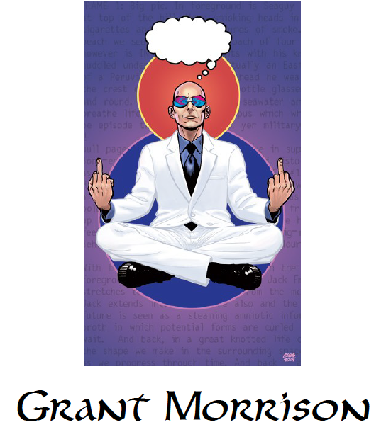

 

- 🕶 [グラント・モリスン著『Pop Magic』への注釈Zine](https://github.com/ravensgate-tux/pop_magic_annotation/blob/main/README.md)
- 🕶 [グラント・モリスン『BATMAN R.I.P.』から読み解く「深淵」と「降下」Zine](https://github.com/ravensgate-tux/batman_rip_zine/blob/main/README.md)
 

#### 3. **🦑 フィル・ハイン関連** 

 

 

- 🦑　[フィル・ハイン著『現代シャーマニズムの技法 第1巻』への注釈Zine](https://github.com/ravensgate-tux/hine_modern_shamanism/blob/main/README.md)
- 🦑　[『喚起魔術の技法──フィル・ハインによる魔術実践と存在論の試み』の翻訳＋注釈Zine](https://github.com/ravensgate-tux/hine_evocation/blob/main/README.md)

 

---

#### 4. 🐝 Servants of the Light（SOL）関連  

 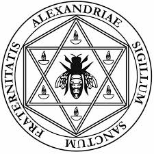

 

SOLロゴ画像出典：[Wikimedia Commons - Servants of the Light](https://commons.wikimedia.org/wiki/File:Servants-of-the-Light.png)  
   ライセンス：Creative Commons Attribution-Share Alike 3.0 Unported（CC BY-SA 3.0）

 

- 🐝　[Servants of the Light（SOL）関連文書への注釈Zine](https://github.com/ravensgate-tux/anthology_of_sol/blob/main/README.md)
  
---

## 🧙 呪術プロトコル

 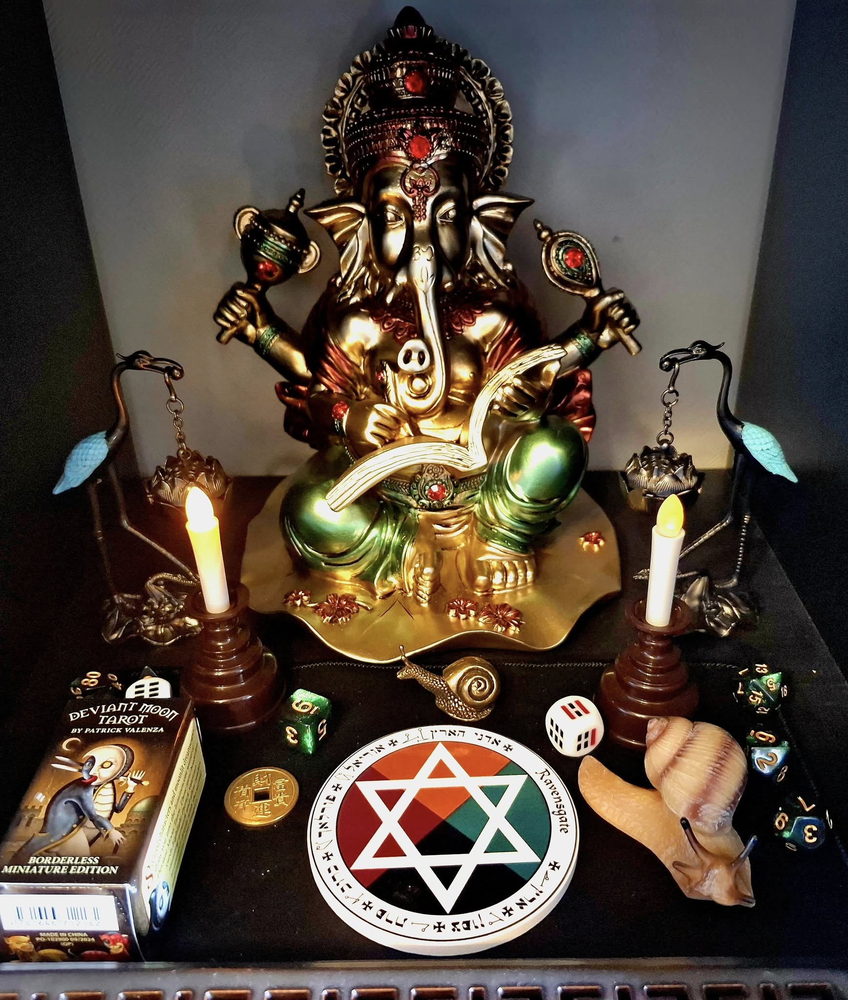

 

- [🌀 Transitus Fluvii（川を渡る者）を使用した、シジル生成（試作版）](https://github.com/ravensgate-tux/passing_river/blob/main/README.md)
- [🐘 ガネーシャ神殿での日拝](https://github.com/ravensgate-tux/ganesha_morning/blob/main/README.md)
- [🐘 ガネーシャへの感謝の儀式](https://github.com/ravensgate-tux/ganesha_gratitude/blob/main/README.md)
- [🐘 ガネーシャへの体重減少（ダイエット）の儀式](https://github.com/ravensgate-tux/ganesha_diet/blob/main/README.md)
- [🌓 ヘカテ女神への日拝](https://github.com/ravensgate-tux/hekate-daily-ritual/blob/main/README.md)
- [🌓 ヘカテ神殿と自宅を保護するための儀式](https://github.com/ravensgate-tux/hekate-protection-ritual/blob/main/README.md)
- [🌓 神殿でのタロット聖別儀式](https://github.com/ravensgate-tux/hekate-tarot-ritual/blob/main/README.md)
- [🌓 旅の安全を祈る儀式](https://github.com/ravensgate-tux/travel-protection-ritual/blob/main/README.md)
- [🌓 ネガティブな影響を追い払う儀式](https://github.com/ravensgate-tux/banishing-negative-ritual/blob/main/README.md)
- [🌓 本棚神殿での金運上昇の儀式](https://github.com/ravensgate-tux/golden-prosperity-ritual/blob/main/README.md)
- [🌓 四元素の夜のワーク](https://github.com/ravensgate-tux/work_elemental_camp_work/blob/master/README.md)
- [🌓 Hekateチャントガイドブック](https://github.com/ravensgate-tux/hekate-chants/blob/main/README.md)
- [🃏 キャンプ地での地霊への祈り（TAZ）](https://github.com/ravensgate-tux/prayer_to_campground/blob/main/README.md)
- [🃏 明日のプレゼンテーションに効く儀式](https://github.com/ravensgate-tux/presentation_spell/blob/main/README.md)
- [🔥 8大祝祭とDeviant Moon Tarotの対応表](https://github.com/ravensgate-tux/document_wheel_of_the_year/blob/main/README.md)
- [🔥 ベルテイン／5月の祭の祝祭プロトコル](https://github.com/ravensgate-tux/beltaine_ritual/blob/main/README.md)
- [🔥 夏至の祝祭儀式の祝祭プロトコル](https://github.com/ravensgate-tux/summer_solstice/blob/main/README.md)
- [🔥 カタツムリの祝祭（4月22日・アースデイ）](https://github.com/ravensgate-tux/snailmas/blob/main/README.md)
- [🔬 本棚神殿の作り方](https://github.com/ravensgate-tux/bookshelf-temple/blob/main/README.md)

 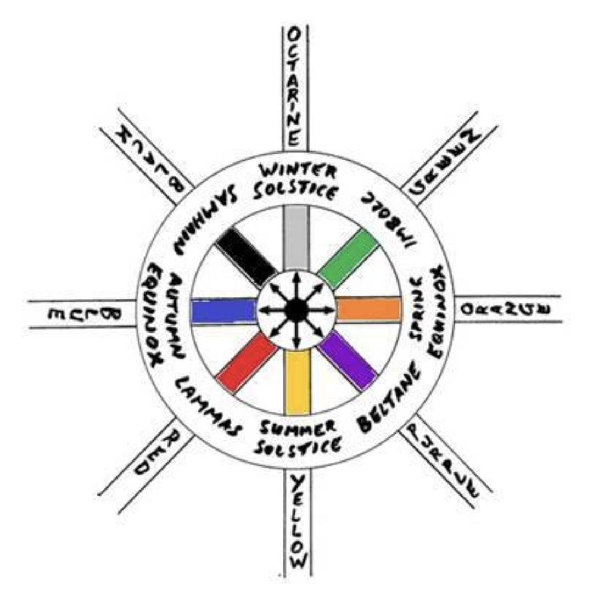

画像出典：Julian Vayne & Steve Dee, Chaos Craft（2018）より引用。図版は教育的・研究目的での紹介のために使用。 
Image credit: Julian Vayne & Steve Dee, Chaos Craft (2018). Used here for educational and research purposes under fair use/fair dealing.
 
 
---

## 🧙 内的ワーク

- [🐘 ガネーシャ・デーモン・モーフィング　（Fil Hine方式）](https://github.com/ravensgate-tux/hine_ganesha_morphing/blob/main/README.md)
- [🌓 ヘカテの三重なる道（Ravensgate流 再構成儀式）](https://github.com/ravensgate-tux/hekate_ascending_flame/blob/main/README.md)
- [🌓 ヘカテの内なる炎](https://github.com/ravensgate-tux/work_frame_threshold/blob/main/README.md)
- [🌓 カードを使った肉体と精神の浄化と調和](https://github.com/ravensgate-tux/work_mental_cleansing/blob/main/README.md)
- [🌓 過去の判断を解放するパスワーキング](https://github.com/ravensgate-tux/work_justice_passworking/blob/main/README.md)
- [🌓 ペンタクルの女王と癒しのパスワーキング](https://github.com/ravensgate-tux/work_healing_queen_of_pentacles/blob/main/README.md)
- [🌓 ヘカテとアゾート瞑想の月の儀式](https://github.com/ravensgate-tux/work_the_moon_hekate/blob/main/README.md)
- [🌓 過去を手放し次の段階へと移行する儀式](https://github.com/ravensgate-tux/work_key_transition/blob/main/README.md)
- [🌓「世界」カードを使った睡眠前の内的ワーク](https://github.com/ravensgate-tux/work_sleep_tarot/blob/main/README.md)
- [🌓 内面の自己と向き合う（内なる十字路）自己鍛錬](https://github.com/ravensgate-tux/work_inner_circle/blob/main/README.md)
- [🃏 自己鍛錬のための The Power of One](https://github.com/ravensgate-tux/work_power_of_one/blob/main/README.md)
- [🃏 Ganesha Kumano Ritual（個人的な儀式：英語）](https://github.com/ravensgate-tux/ganesha_kumano_ritual/blob/main/README.md)
- [🃏 Deviant Moon Tarot 解説Zine](https://github.com/ravensgate-tux/deviant_moon/blob/main/README.md)
- [🔬 漢字シジル・プロトコル v0.1（試作版）](https://github.com/ravensgate-tux/kanji-sigil/blob/main/README.md)
- 💻 [Witchcraft API v0.1（βテスト中）](https://github.com/ravensgate-tux/witchcraft_api_v01/blob/main/README.md)

 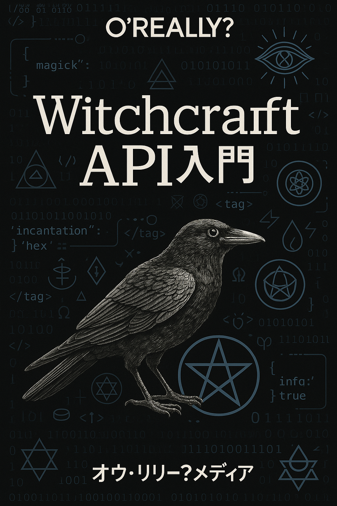

---

## 🧙‍♂️ 編集・注釈 by *Le Sorcier Inconnu*（知られざる呪術師）

> 忘れられたもの、無視されたもの、まだ名前のないものへ  
> 書かれざる言葉に、注釈という魔術を与える者

---

© 2025 知られざる呪術師（Le Sorcier Inconnu）  
本ドキュメントは [Creative Commons BY-SA 4.0](https://creativecommons.org/licenses/by-sa/4.0/deed.ja) に基づき公開されています。
